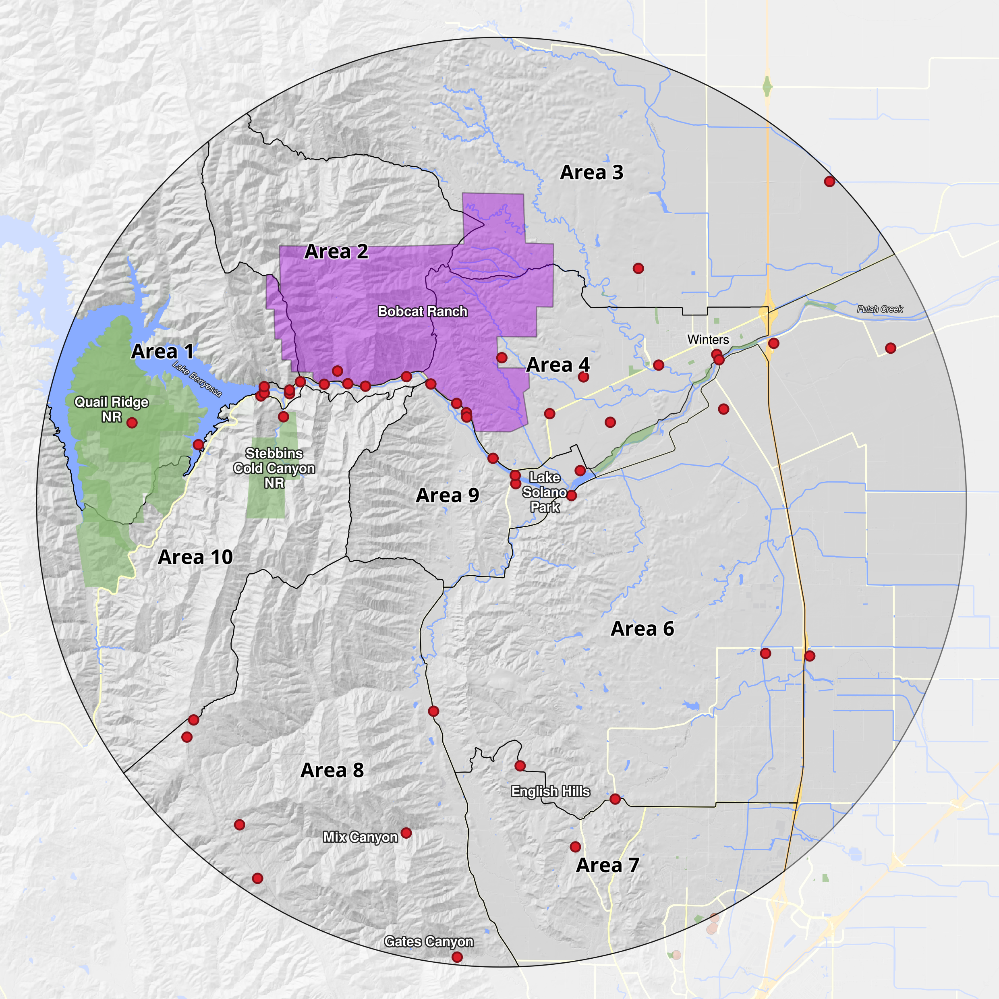

# CBC Species Plot

## About the Christmas Bird Count
The Christmas Bird Count is the nation’s longest-running community science bird project.  
It occurs annually between December 14 and January 5 in over 3000 count circles.  
More information can be found on the [Audubon website](https://www.audubon.org/community-science/christmas-bird-count). 

## The Putah Creek CBC
The Putah Creek CBC started in 1971 and has been held on the third Sunday of December every year since then. This count is organized and sponsored by the [Yolo Bird Alliance(https://yolobirdalliance.org/). 

The count is conducted by consistently covering 
10 sub-areas with 70-100 participants each year. 

## About the tool
This tool allows visualization of the Putah Creek CBC (CAPC) long-term dataset. A set of indicators and a subset of species has been added to evaluate trends in:
- Owl counts
- Fire affected species
- Climate change indicator species
- Land use change indicator species

- Project page: https://hydrospheric0.github.io/cbc-capcplot/

## Project layout

- `data/CAPC_CBC_1971_2025_v2.1.csv` – long-term CBC table (wide format with year columns)
- `data/archive/` – archived historical input datasets
- `index.html` – the plot (self-contained HTML)
- `package.json` – npm scripts for dev/build/preview

Older CSV inputs are archived under `data/archive/`.

## Support
If you find this tool useful, please consider supporting its development:

